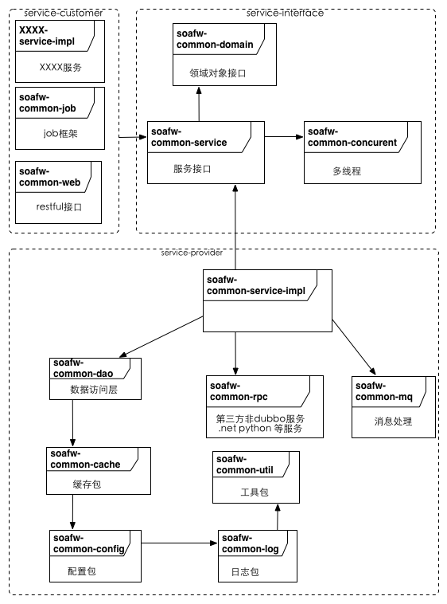

## 框架

#### soa服务框架包图

##### tower-soa－framwork
+ 跨境通统一的java框架
+ j2ee、spring、mybaties、springmvc、freemarker、memchecache、redis、mysql等

###### tower－util
+ 框架中的公共类，eg：工具类 

###### tower－concurrent
+ 框架中多线程处理模版类
+ 同步锁处理类

###### tower－log
+ 日志处理相关类

###### tower－config
+ 具体模块配置文件，通过java 属性机制进行改变-Dxxx=yyy
+ 配置文件存储目录：
	+ 配置目录有三级，安优先级列表如下，序号最小优先级最高
		+ 1,应用配置，位置在应用用安装目录下的config目录
		+ 2,框架默认配置目录,默认在/config，可以通过-Dconfig.file.dir=iiii进行设置调整
		+ 3,classpath:META-INF/config/local/
	+ 配置文件格式支持
		+ xml
		+ properties
	+ 支持动态加载机制
	+ 相关设计模式：代理设计模式
	+ 相关配置文件：从框架级别进行解耦
		+ 资源类型：支持多组机制
			+ database.properties
			+ cache-mem.properties
			+ cache-redis.properties
			+ mq.properties
			+ dubbo.properties
		+ 开关类型：按层管理
			+ acc.xml
			+ service.xml
			+ weblayer.xml
			+ rpc.xml
			+ job.xml
		
###### tower－mq
+ 负责消息中间件通信的模块

###### tower－rpc
+ rpc通信模块
	+ http
	+ rmi
	+ hessian

###### tower－cache
+ 缓存机制模块
	+ mem cache
	+ redis
	+ 。。。no sql

###### tower－dao
+ 数据访问层框架模块
+ 关系型数据库访问层接口及默认实现机制（mybaties）

###### tower－model
+ 业务模型对象模块
	+ DTO
	+ BO

###### tower－job
+ job框架模块
+ job监控信息采集

###### tower－service
+ service框架模块
+ service服务监控信息采集

##### 相关工具
+ 服务项目框架生成器
	+ 项目生成工具
		+ tower-tools
		+ ./gen_all.sh hello company 生成项目的所有模块
		+ ./gen_job.sh hello company xxx 生成特地的job
		+ ./gen_service.sh hello company 生成服务框架
		+ ./gen_web.sh hello company 生成web框架
	+ 数据访问层代码生成器
		+ import hello-dao as maven 项目
		+ 在src/test/java中找到com.kjt.service.hello.dao.DaoGen
		+ 按照提示修改DaoGen.java内容
		+ 运行DaoGen
	+ exception管理工具
	+ 代码发布脚步工具
		+ 生成版本号
			+ sh publish.sh hello 
		+ 发布代码到服务器
			+ sh rsyc.sh hello yyyy-MM-dd_xxx targetIp userId
	+ 测试框架代码生成器插件
		+ 默认是关闭的,可以通过-Dsoafw.tester.gen=true的方式开启
+ checkstyle

##### 相关标准
+ 编程规范
+ 测试规范
+ RESTful
+ dubbo

##### deploy
+ mvn deploy

