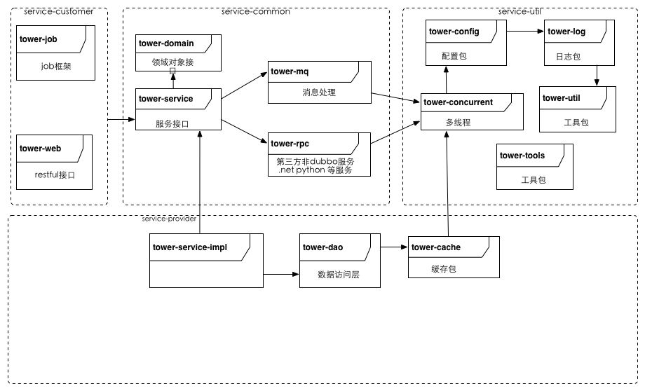

## 框架使用说明

#### 安装git
#### 搭建本地私服库（nexus）
+ 备注：个别java包可能需要在互联网上单独下载，公共的私服服务上可能没有；
+ 配置maven配置文件settings.xml
<p>详细配置信息</p>
```
	...
	<pluginGroups>
	
		<pluginGroup>com.tower.soafw</pluginGroup>
		
  	</pluginGroups>
  	
	<mirrors>
	
 		<mirror>
 		
			<id>UK</id>
			
			<name>UK Center</name>
			
			<url>http://uk.maven.org/maven2</url>
			
			<mirrorOf>center</mirrorOf>
			
		</mirror>
		
		<mirror>
		
  			<id>CN</id>
  			
  	  		<name>OSChina Central</name>
  	  		
  	  		<url>http://maven.oschina.net/content/groups/public/</url>
  	  		
  	  		<mirrorOf>central</mirrorOf>
  	  		
  		</mirror>
  		
		<mirror>
		
			<id>US Central</id>
			
			<name>Center</name>
			
			<url>http://repo1.maven.org/maven2</url>
			
			<mirrorOf>center</mirrorOf>
			
		</mirror>
		
	</mirrors>
	
	...
```
#### 安装Jenkins（构件）

## 框架介绍

#### soa服务框架包图



##### tower-soa－framwork
+ 统一的java框架
+ j2ee、spring、mybaties、springmvc、freemarker、memchecache、redis、mysql等

###### tower－util
+ 框架中的公共类，eg：工具类 

###### tower－concurrent
+ 框架中多线程处理模版类
+ 同步锁处理类

###### tower－log
+ 日志处理相关类
+ 每条日志信息都会自动输出当前请求ID(当当前请求没有请求ID时，框架会自动产生，并且一直跟着到最后：追加到sql语句的备注部分)

###### tower－config
+ 配置文件存储目录：
	+ 配置目录有三级，安优先级列表如下，序号最小优先级最高
		+ 1,应用配置，位置在应用用安装目录下的config目录
		+ 2,框架默认配置目录,默认在/config，可以通过-Dconfig.file.dir=iiii进行设置调整
		+ 3,classpath:META-INF/config/local/
	+ 配置文件格式支持
		+ xml
		+ properties
	+ 支持动态加载机制［上面1，2项配置支持动态加载］
	+ 相关设计模式：代理设计模式
	+ 相关配置文件：从框架级别进行解耦
	+ 每个配置文件都支持全局级配置及应用级配置
		+ 全局配置规则：不含有'.'符号／或者以'global.'开头
		+ 应用配置规则：应用id（以job Id、serviceId等）开头，用'.'连接配置项；
		+ 资源类型：支持多组机制
			+ database.properties
			+ cache-mem.properties
			+ cache-redis.properties
			+ mq.properties
			+ dubbo.properties
		+ 开关类型：按层管理
			+ acc.xml（数据访问层）
			+ service.xml（service层）
			+ webapp.xml（webapp层）
			+ rpc.xml（rpc层）
			+ job.xml（job层）
###### tower－mq
+ 负责消息中间件通信的模块

###### tower－rpc
+ rpc通信模块（第三方通信）
	+ http
	+ rmi
	+ hessian

###### tower－cache
+ 缓存机制模块
	+ mem cache
	+ redis
	+ 。。。no sql

###### tower－dao
+ 数据访问层框架模块
+ 关系型数据库访问层接口及默认实现机制（mybaties）
+ 数据访问层代码生成器目前支持mysql、sql server

###### tower－model
+ 业务模型对象模块
	+ DTO 建议其子类实现toString()方法
	+ BO 建议其子类实现toString()方法

###### tower－service
+ service框架模块
+ service服务监控信息采集

###### tower－job
+ job框架模块
+ job监控信息采集
+ 可以动态调整job调度策略
+ 可以通过status=pause的方式动态暂停job的执行（可以控制所有、一组及单独的某一个job）

###### tower－web
+ web框架模块
+ web监控信息采集
+ 通过RequestInterceptor
	+ 拦截并读取head参数［X-Request-ID］情况来获取或者产生请求id（X-Request-ID为空时自动产生）,当没有设置时系统会自动产生一个reqid,并且一直往后传，直到db上执行的sql语句；
	+ 拦截并读取head参数［X-Cached］缓存开关参赛，决定是否启用缓存［默认情况下启用缓存］

+ 插件
	+ 项目框架生成插件（tower-config-maven-plugin）
	+ 测试框架代码生成器插件(tower-test-maven-plugin)
		+ 默认是关闭的,可以通过-Dsoafw.tester.gen=true的方式开启
##### 相关工具
+ 服务项目框架生成器
	+ 项目生成工具
		+ tower-tools
		+ ./gen_all.sh hello company 生成项目的所有模块
		+ ./gen_job.sh hello company xxx 生成特定的job
		+ ./gen_service.sh hello company 生成服务框架
		+ ./gen_web.sh hello company 生成web框架
	+ 数据访问层代码生成器
		+ 支持mysql、sql server
		+ 支持事务（单数据库的两阶段提交分布式事务）
		+ import hello-dao as maven 项目
		+ 在src/test/java中找到com.[company].service.hello.dao.DaoGen
		+ 按照提示修改DaoGen.java内容
		+ 运行DaoGen
	+ 代码发布脚步工具 publish目录下
		+ 生成版本号
			+ sh publish.sh hello 
		+ 发布代码到服务器
			+ sh rsyc.sh hello yyyy-MM-dd_xxx targetIp userId

+ exception管理工具
+ checkstyle

##### 相关标准
+ 编程规范
+ 测试规范
+ RESTful
+ dubbo

##### deploy
+ mvn deploy

## 

