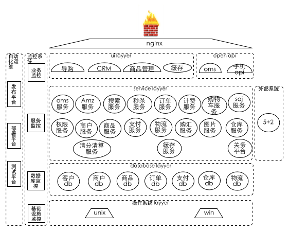
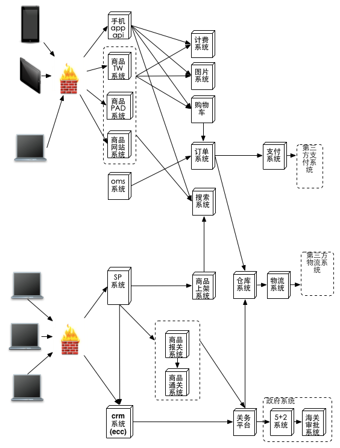
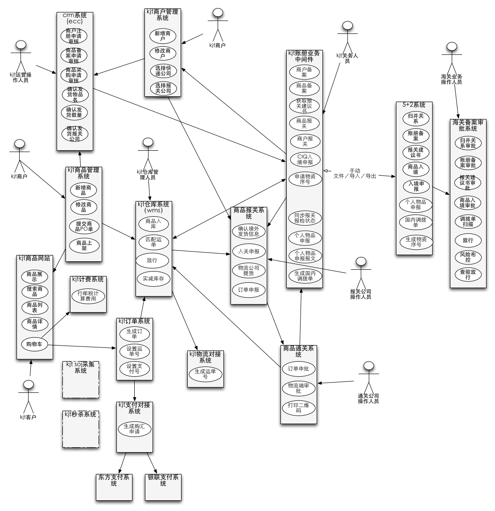
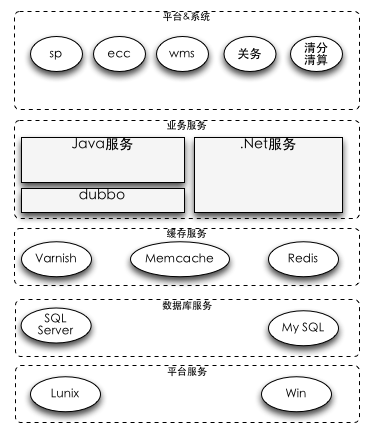
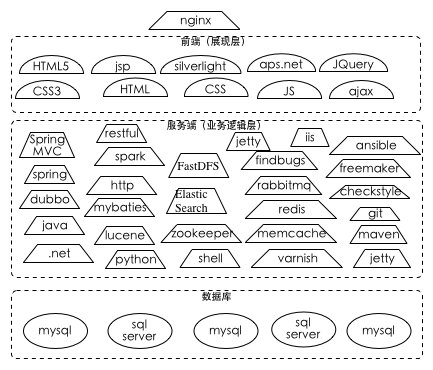
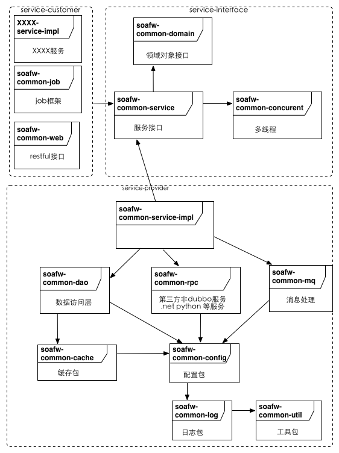

## 架构
### 宗旨
#### 高可用性
+ 自动化运维
	+ 自动化化部署
		+ 统一部署机制
		+ 系统自动化部署
		
	+ 监控平台
		+ 系统基础设施监控
		+ 业务系统监控
		+ 业务数据监控
		
	+ 发布平台
		+ 支持灰度发布
		+ 支持版本快速回滚
		
	+ 自动测试
		+ 自动化测试平台
		+ 单元测试
		
#### 高扩展性
+ 系统架构简单清新
+ 易水平扩展
+ 业务功能能够增加方便

#### 低风险、低成本
+ 提高服务的重用性
+ 提高开发效率
+ 利用成熟的开源技术
+ 启用虚拟化技术

#### 高质量、高效率
+ 重复的事情工具化
+ 复杂的事情简单化
+ 人工的事情系统化
+ 采用敏捷思想指导开发

#### 系统架构图

### 业务架构图

### 系统用例图

### 技术架构

#### 技术架构图

#### 技术栈

#### 以SOA思想架构系统

##### soa 平台
+ dubbo

##### kjt－framwork
+ 跨境通统一的java框架
+ j2ee、spring、mybaties、springmvc、freemarker、memchecache、redis、mysql等

##### soa服务框架包图

###### common－util
+ 框架中的公共类，eg：工具类 

###### common－log
+ 日志处理相关类

###### common－config
+ 具体模块配置文件，通过java 属性机制进行改变-Dxxx=yyy
+ 配置文件存储目录：默认存放在： /config，可以通过java属性机制进行改变-Dconfig.file.dir=iiii进行设置
+ 框架配置：当在当前目录找不到指定文件时，会到classpath:META-INF/config/local/ 目录中查找；
+ 配置文件格式支持
	+ xml
	+ properties
+ 支持动态加载机制
+ 相关设计模式：代理设计模式
+ 相关配置文件：从框架级别进行解耦
	+ 资源类型：支持多组机制
		+ database.properties
		+ cache-mem.properties
		+ cache-redis.properties
		+ mq.properties
	+ 开关类型：按层管理
		+ acc.xml
		+ service.xml
		+ webapp.xml
		+ rpc.xml
		+ mq.xml
	
+ 应用服务个性化配置：
    + dao层配置
        + 配置目录:resource/META-INF/config/spring
            + spring-db.xml
            + spring-cache.xml
        
    + rpc层配置
        + 配置目录:resource/META-INF/config/spring
            + spring-rpc.xml
        
    + 服务实现配置
        + 配置目录:resource/META-INF/config/spring
            + spring-service.xml
    
    + web app配置
        + 配置目录:resource/META-INF/config/spring
            + application-config.xml
            + mvc-config.xml
        + web.xml
        
###### common－cache
+ 缓存机制模块
	+ mem cache
	+ redis
	+ 。。。no sql

###### common－dao
+ 数据访问层框架模块
+ 关系型数据库访问层接口及默认实现机制（mybaties）

###### common－model
+ 业务模型对象模块
	+ DTO
	+ BO

###### common－job
+ job框架模块
+ job监控信息采集

###### common－concurrent
+ 框架中多线程处理模版类
+ 同步锁处理类

###### common－service
+ service框架模块
+ service服务监控信息采集

###### common－mq
+ 负责消息中间件通信的模块

###### common－rpc
+ rpc通信模块
	+ http
	+ rmi
	+ hessian
	
###### common－service-impl
+ service抽象实现

##### 相关工具
+ 数据访问层代码生成器
+ exception管理工具
+ 服务项目框架生成器
+ checkstyle
+ log4e插件
+ logbak
+ 测试框架代码生成器插件－－待完成；
+ aop统一采用静态机制（aspectj-maven-plugin），不建议采用动态机制；

##### 相关标准
+ 编程规范
+ 测试规范
+ RESTful
+ dubbo

